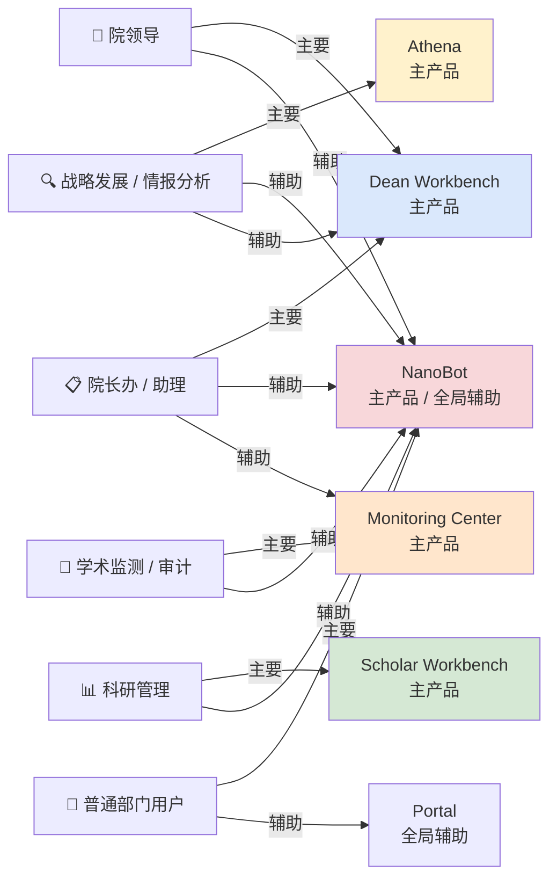
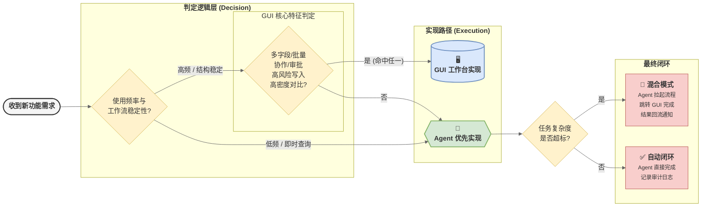
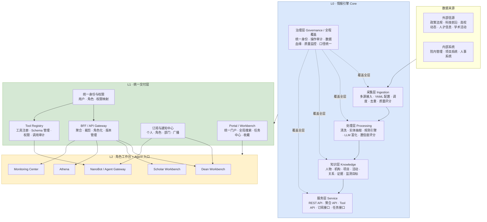
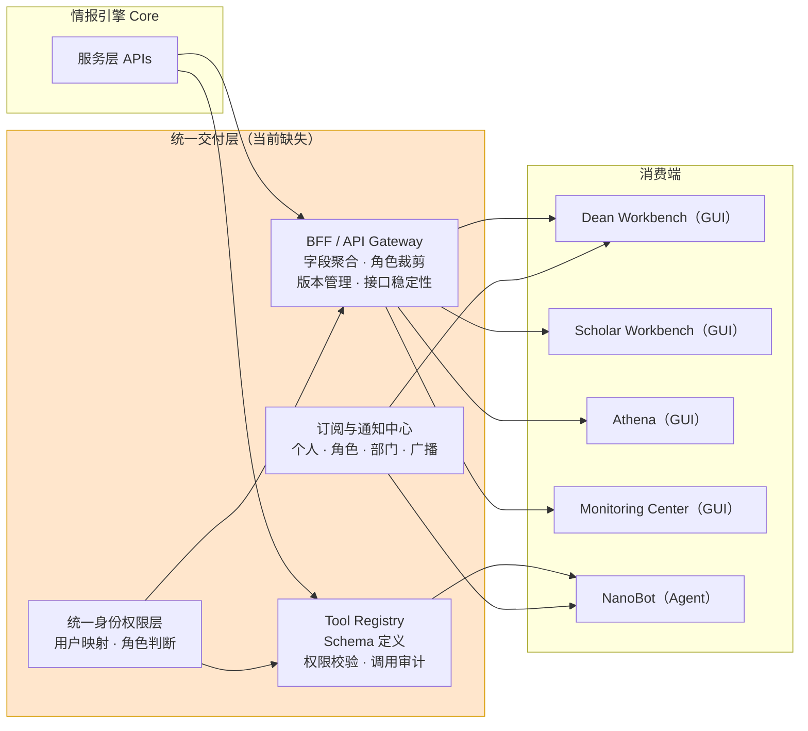
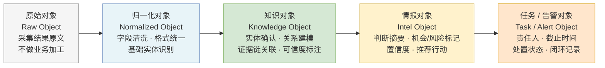
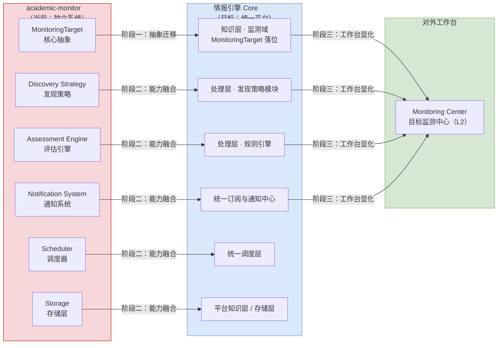
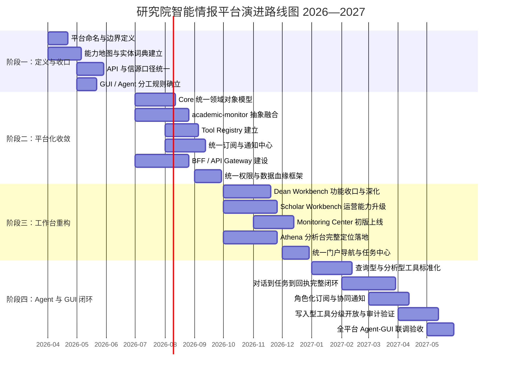

# 研究院智能情报平台 · 产品战略规划书

| **属性** | **内容** |
| --- | --- |
| 文件类别 | 平台产品战略规划书 |
| 版本 | V1.1 |
| 更新日期 | 2026-03-31 |
| 适用项目 | DeanAgent-Backend · Dean-Agent-Fronted · Scholars-System · academic-monitor · Dean-NanoBot |
| 文件状态 | 审阅稿，待团队对齐后转为执行版本 |

## 第一章　背景与现状审视

### 1.1　这份文档的定位

当前工作区中的五个项目在命名和描述上看起来各自独立，但在实际运行中，它们已经在共用同一套采集调度、分享同一套数据存储、消费同一批处理管道的输出结果

*   这种**「事实上的平台」**与**「认知上的多项目并行」**之间的落差，正在具体地影响每一次新需求的决策过程——**需求到来时，没有标准判断它归属哪个产品**；
    
*   功能膨胀时，没有清晰边界阻止一个前台无限扩张；
    
*   底层能力重复建设时，没有共识判定哪套是**「正确的那一套」**
    

本文档的目标正是填补这个落差：它不是某个具体功能的需求规格，也不是某个项目的技术方案文档，而是为整个情报引擎体系提供统一的战略框架：

1.  明确平台是什么
    
2.  各产品边界在哪里
    
3.  未来如何演进
    
4.  新需求应如何决策
    

凡是在这些问题上出现分歧的场合，本文档应作为第一参考依据，而不是各项目 README 或各阶段开发记录的拼凑

### 1.2　五个项目的真实形态

从代码结构、文档现状和实际调用关系来看，这五个项目的真实角色如下表所示：

:::
值得注意的是，**没有任何一个项目真正「独立」——它们全部在消费同一套底层能力**，并在不同场景下面向不同角色输出结果
:::

| **项目名称** | **当前形态描述** | **实际扮演的角色** | **主要服务对象** |
| --- | --- | --- | --- |
| `DeanAgent-Backend` | 爬虫框架 + REST API + 处理 Pipeline + 学者机构服务 | 情报底座与数据中台雏形 | 所有上层产品 |
| `Dean-Agent-Fronted` | 院长端 Web 前台 | 领导决策驾驶舱 | 院长办、院领导 |
| `Scholars-System` | 学者、机构、项目、活动管理前台 | 学术知识运营台 | 科研管理、情报运营 |
| `academic-monitor` | 泛化目标监测框架 | 目标监测引擎 | 学术监测、审计告警 |
| `Dean-NanoBot` | IM 与 Agent 助手框架 | 统一自然语言入口与触达层 | 全院各部门 |

### 1.3　平台化信号已经出现

从已有的代码和文档中可以清晰地看到，平台底座的雏形早已形成：

*   **采集层方面**：多类爬虫模板、自定义解析器和定时调度已经统一运行；
    
*   **处理层方面**：政策、人事、科技、高校、简报等多条情报处理 Pipeline 共享底层框架；
    
*   **服务层方面**：REST API 已经覆盖文章、学者、机构、项目、活动、情报等多个领域；
    
*   **消费端方面**：领导前台、知识库前台、监测系统和 Agent 入口都在消费来自同一底座的数据；
    

这个判断决定了下一阶段真正应该做什么：**当平台底座的雏形已经存在，继续以「开新项目」的方式响应每一个新需求，实质上是在一个正在成形的地基上持续出砖，而不是在把地基建稳之后向上盖楼**

### 1.4　四个必须正视的结构性问题

1.  **能力被按需求重复建设，而非按设计统一规划。** 每当一个部门提出新的场景需求，最便捷的响应路径往往是在最近的项目里快速实现，而不是判断这个能力是否应该沉淀进底座。长此以往，同一份采集或处理能力在多个项目中分别封装，同一个需求在 GUI 和 Agent 中各做一遍，某个前台持续吸收并不属于其核心价值的模块。边界越来越难以厘清，能力越堆越多但平台整体可维护性却在下降；
    
2.  **领导驾驶舱与运营系统的边界已经混淆：**`Dean-Agent-Fronted` 在迭代过程中积累了或被要求积累大量院内管理、项目督办、学生事务、CRM 式关系维护等功能模块。这些场景本质上是运营型工作，需要完整的写入审计、稳定的权限机制和长流程协作能力，与**「领导快速消费情报结论」**的核心场景在产品逻辑上截然不同。如果不主动收口，这个前台会持续滑向「万能领导门户」，失去它最根本的产品焦点，同时两类需求都因为相互干扰而做不好；
    
3.  **监测能力正在双轨并行中走向重复建设：** `academic-monitor` 已经独立建立了一套覆盖目标配置、多源发现、评估规则、调度、存储和通知机制的完整体系，这与 `DeanAgent-Backend` 的部分 Pipeline、处理框架和存储机制已高度同构。两套系统如果继续沿各自路线独立演进，必然形成双调度体系、双存储、双告警规则和双权限管理，任何底层调整都需要在两套系统中同步维护，维护成本和认知成本将持续攀升；
    
4.  **关键指标口径已经不一致，说明治理问题不再是潜在风险：** `DeanAgent-Backend` 的主 README 以 181 个信源、65+ 个 API 端点为口径，而 `docs/api/API_REFERENCE.md` 已统计为 225 个信源、125 条 API 路由。这个落差不是文档滞后的问题，而是说明平台已经缺少**「唯一事实来源（Single Source of Truth）」**，如果此时继续扩展功能，后续的资源评估、跨团队协作和对外汇报都将建立在不一致的数字基础上，产生系统性的认知偏差；
    

## 第二章　平台定位与战略目标

### 2.1　产品总定位

:::
这套体系的统一名称建议为**研究院智能情报平台**，界定它是什么的最关键一点，不在于它包含哪些功能，而在于它的定位层次：**它是一套服务于研究院战略决策、科研管理、人才观测、学术生态建设和日常信息工作的智能基础设施，而不是一个产品或一个 Agent**；

**基础设施的含义**是：其价值不体现在某一个页面或某一次对话上，而体现在持续采集外部信号、将原始数据加工为高质量情报对象、让不同角色以最合适的方式消费、并将整个过程沉淀为可复用平台资产这一完整链条上；

**一句话定义**：**这不是很多个 AI 项目，而是一个面向研究院的情报操作系统。**
:::

### 2.2　北极星五项能力

研究院智能情报平台需要最终交付五项核心能力：

1.  **持续感知**，即自动化、无间断地获取政策、科技、人事、高校动态等外部关键信号以及院内业务事件，感知盲区不应持续扩大；
    
2.  **智能加工**，即将原始信息处理成可判断、可行动的情报对象，而不只是原始内容的聚合摆放，判断卡片、置信度评分和机会识别是衡量这项能力的具体标志；
    
3.  **角色化消费**，即院领导、科研管理、情报分析人员等不同角色能够以最适合自己工作习惯和认知负荷的形态接收和使用情报，没有人需要在错误的界面完成核心工作；
    
4.  **闭环协同**，即从信号发现到告警处置、从初步查询到专题分析、从 Agent 问答到 GUI 操作，每一个工作流都能形成可追踪的闭环，而不是停留在孤立工具的层面；
    
5.  **平台沉淀**，即所有能力形成可复用的平台资产，新需求的满足通过组合已有能力实现，不需要每次都重建基础设施；
    

### 2.3　产品矩阵与层级关系

平台产品体系分为三个层级，其结构关系如下图所示：

:::
层级之间存在严格的能力依存关系：

L2 工作台的所有数据能力来自 L0 Core，通过 L1 统一交付层分发；

L2 产品不应绕过 L1 直接依赖 L0 底层结构；

这不是一个可以弹性遵守的建议，而是防止平台退化为若干个垂直烟囱系统的关键约束。
:::

| **层级** | **产品 / 能力** | **产品定位** | **核心用户** | **主要交互方式** |
| --- | --- | --- | --- | --- |
| L0 | 情报引擎 Core | 情报底座、知识底座、监测底座 | 平台内部（其他产品） | API / Tools / Pipeline |
| L1 | Portal / Workbench | 统一门户、搜索、通知、任务入口 | 全院各角色 | GUI |
| L1 | NanoBot / Agent Gateway | 自然语言入口、工具编排、消息触达 | 全院员工 | Agent / Ding Talk IM |
| L2 | Dean Workbench | 领导决策驾驶舱 | 院长办、院领导 | GUI + Agent 辅助 |
| L2 | Scholar Workbench | 学术生态知识运营台 | 科研管理、知识运营 | GUI |
| L2 | Athena | 战略研判与专题分析台 | 战略发展、分析团队 | GUI + Agent 辅助 |
| L2 | Monitoring Center | 目标监测、规则评估、预警闭环台 | 监测团队、专项治理团队 | GUI + Agent 辅助 |

## 第三章　角色地图与工作台设计

### 3.1　平台服务的六类核心角色

平台需要服务的角色在信息需求和使用习惯上存在显著差异，正是这种差异驱动了多工作台的架构设计。用一套界面服务所有角色，结果往往是所有角色的体验都被分散的功能稀释，没有人能高效完成核心工作。

| **角色** | **主要目标** | **核心诉求** | **对信息的容忍深度** |
| --- | --- | --- | --- |
| **院领导** | 快速掌握外部态势并形成判断 | 高密度结论、风险提示、机会信号、行动建议 | 只接受结论，不接受原始数据 |
| **院长办 / 助理** | 简报整理、优先级排序、关键事项跟踪 | 信息汇总、提醒机制、行动建议、日程辅助判断 | 可处理中等密度信息，需要结构化输出 |
| **科研管理** | 维护学者、机构、项目、活动与关系台账 | 结构化录入、批量操作、台账治理、审核工作流 | 需要完整明细，高度依赖结构化工具 |
| **战略发展 / 情报分析** | 专题研判与趋势分析 | 深度检索、多维筛选、时序追踪、专题产出 | 主动探索全量数据，对深度要求最高 |
| **学术监测 / 审计人员** | 监测特定目标并追踪和处置异常 | 规则配置灵活、告警及时、证据链完整可回溯 | 对精确性要求极高，需要可溯源的证据 |
| **普通部门用户** | 快速提问或接收推送信息 | 低门槛访问、订阅管理、消息接收 | 低信息密度，倾向被动接收 |

### 3.2　角色与产品的映射关系

### 3.3　各工作台的职责边界

明确每个工作台**「不做什么」**与明确**「做什么」**同等重要，甚至更重要，以下对五个主要产品分别给出职责范围的显式约束

#### 3.3.1    Dean Workbench（院长决策驾驶舱）

这个产品的核心价值主张是：让院领导在最短时间内获得最高密度的判断结论，而不是在最多信息中自行筛选，这个价值主张决定了它只应该呈现加工后的情报结果，不应该成为操作和录入型功能的聚合地

| **明确在职责范围内** | **明确不在职责范围内** |
| --- | --- |
| 每日情报简报生成与展示 | 复杂台账维护与大量人工录入 |
| 政策 / 人事 / 科技 / 高校态势感知 | 学生事务管理与全流程跟踪 |
| 关键人物、关键事项、关键机会告警 | 项目督办的系统化运营 |
| 活动邀约筛选与日程辅助判断 | CRM 式人脉关系维护 |
| 领导关注清单与个性化提醒 | 内部审批与多人协作工作流 |
| 情报结论的判断卡片与行动建议 | 完整的数据配置和规则管理 |

#### 3.3.2    Scholar Workbench（学术生态运营台）

这个产品是平台知识资产的生产后台，而非消费前台，Dean Workbench 和 NanoBot 消费的是最终情报结论，Scholar Workbench 维护的是支撑这些结论的原始知识资产，这个角色赋予它在平台中举足轻重的地位——平台数据的可信度，很大程度上取决于这里的数据质量

| **明确在职责范围内** | **明确不在职责范围内** |
| --- | --- |
| 学者档案的结构化录入、校准与维护 | 领导态势驾驶舱与摘要展示 |
| 机构树的治理与层级关系维护 | 即时问答入口与自然语言查询 |
| 项目库与活动记录的管理 | 深度专题分析与趋势研判工作流 |
| 合作关系与证据链的补录 | 监测规则的配置与告警处置 |
| 数据导入、审核、纠错、比对工作流 | 对外推送与订阅管理 |
| 数据来源、更新时间、可信度可视化 | 任何仅服务于领导视角的模块 |

#### 3.3.3    Athena（战略分析台）

Athena 的目标用户是需要主动探索数据的专业分析人员，其产品逻辑与驾驶舱完全不同：驾驶舱强调结论密度和时效性，分析台强调探索性和数据深度，两者服务不同的认知需求，不应相互替代

| **明确在职责范围内** | **明确不在职责范围内** |
| --- | --- |
| 全量数据的深度检索与多维过滤 | 结构化知识台账的录入和维护 |
| 专题分析项目的创建与管理 | 订阅触达与消息推送 |
| 时序趋势追踪与可视化 | 领导视角的摘要首页 |
| 对标分析与机会挖掘 | 监测规则配置与实时告警 |
| 分析报告的结构化产出 | 即时问答与快速查询（由 NanoBot 承担） |

#### 3.3.4    Monitoring Center（目标监测中心）

这是一个持续运行的监测控制面，其核心价值是：对任何被关注的对象，都能实现从配置规则到触发告警、从人工确认到闭环记录的完整运营链路

| **明确在职责范围内** | **明确不在职责范围内** |
| --- | --- |
| 监测目标的创建、分类与管理 | 泛化情报首页与非监测场景的信息展示 |
| 监测策略与评估规则的配置 | 复杂学术知识的结构化运营 |
| 告警触发、证据查看与闭环确认 | 学者和机构档案的基础维护 |
| 监测报告的周期性产出 | 领导决策辅助与简报生成 |
| 告警历史与处置记录的审计回溯 | 深度趋势分析与对标研判 |

#### 3.3.5    NanoBot / Agent Gateway（统一 Agent 入口）

NanoBot 是平台的操作面，负责连接用户与平台能力的最后一公里，它的价值在于低门槛、高灵活性和全院统一，而不是替代任何一个 GUI 工作台，主要结合了DingTalk的能力

| **明确在职责范围内** | **明确不在职责范围内** |
| --- | --- |
| 自然语言快速问答与跨域检索 | 替代 GUI 完成复杂结构化录入 |
| 跨产品工具调用与数据取数 | 绕开权限治理直接写入平台数据 |
| 对话转任务、任务转通知、通知转回执 | 独立承担高风险批量操作 |
| 个人/角色/部门订阅管理 | 承接需要多人协作和审批的长流程 |
| 多渠道消息推送与广播 | 成为某类业务的唯一信息来源 |

### 3.4　GUI 与 Agent 的分工原则

在确定一个新功能应通过 GUI 实现还是通过 Agent 实现时，应遵循以下决策路径，而不是基于"更酷炫"或"技术实现更简单"来判断：

这个决策树的底层逻辑是：GUI 的优势在于稳定性、可操作性和高信息密度；Agent 的优势在于灵活性、低门槛和串联能力。"Agent 拉起，GUI 完成"是两种形态协同的最佳实践，不应把所有工作都塞进对话框，也不应把所有工作都强制要求用户打开完整界面。

### 3.5　典型任务分流规则

| **需求类型** | **建议入口** | **最终落点** | **典型示例** |
| --- | --- | --- | --- |
| 快速查询某条信息 | NanoBot | 直接回答或跳转工作台 | "最近有哪些 AI 政策值得关注？" |
| 浏览领导情报简报 | Dean Workbench | 驾驶舱首页 | 每日例行情报消费 |
| 维护学者档案 / 机构台账 | Scholar Workbench | 知识运营台 | 补录某位学者的论文记录 |
| 专题分析与趋势研判 | Athena | 分析台 | 某领域近三年论文趋势对比 |
| 配置监测规则与处置告警 | Monitoring Center | 监测工作台 | 为某机构设置动态追踪规则 |
| 订阅特定事件推送 | NanoBot / Portal | 订阅中心 | 订阅每周高校人才动态摘要 |
| 复杂数据补录（Agent 识别触发） | NanoBot → Scholar Workbench | 知识运营台 | Agent 发现学者信息缺失并引导用户补录 |

## 第四章　平台架构与能力分层

### 4.1　目标架构全景

### 4.2　五层能力模型详解

*   **采集层（Ingestion）** 的使命是持续、稳定地获取外部和内部信号。当前平台已有 YAML 配置信源、多类爬虫模板、自定义解析器（parser）、定时调度，以及增量拉取与去重能力。在此基础上，未来需要重点补齐的方向是：建立统一的信源接入规范，使每一条新信源的接入都遵循可验证的标准格式；建立接入状态监控，使任何一条信源的异常都能被及时发现；建立数据源质量评分机制，让下游处理层和消费端知道每一条数据来源的可靠程度。采集层的边界非常清晰：它只负责"把数据拿回来"，不做任何业务判断，不生成任何结论。凡是"判断这条数据重不重要"的逻辑，都不属于采集层的职责；
    
*   **处理层（Processing）** 的使命是将原始数据转化为可判断、可行动的情报对象。当前平台已有政策、人事、科技、高校、简报等多条处理 Pipeline，以及规则引擎、LLM 富化、标签打分和主题聚合能力。未来需要补齐的关键能力是实体抽取与归一（让不同信源中对同一个人或机构的描述能够汇聚到同一个实体对象），跨源合并与语义去重，置信度评分（让每一个情报对象都携带"这条信息有多可信、依据是什么"的元信息），以及机会识别和风险识别（将模式判断从人工经验转移到自动化处理）。处理层输出的必须是标准化的中间结果，不应直接耦合任何一个前台的展示字段——一旦处理层直接为某个页面生产数据，任何 UI 改版都会触发处理层的被动修改；
    
*   **知识层（Knowledge）** 的使命是沉淀可长期复用的知识资产。平台中长期有价值的核心对象包括：文章、政策、人物、学者、机构、项目、活动、事件、关系、证据、监测目标和任务。知识层不只是存储这些对象，还需要提供统一实体 ID（确保同一个实体在整个平台只有一个标准 ID）、统一关系模型、对象快照与版本历史、证据链存储，以及支持人工校准的双向回写通道。**知识层的边界约束是：只沉淀长期可复用的资产，不存入仅用于一次性展示而生成的临时拼接对象**。两者混用会导致数据血缘难以追踪，校准也无法回写到正确的层级；
    
*   **服务层（Service）** 的使命是以稳定契约向 GUI 和 Agent 暴露能力。当前平台已有覆盖多个业务域的 REST API，但还需要在此基础上建立两个关键子层：**BFF/API Gateway**，负责为不同前台聚合和裁剪字段、屏蔽底层结构变更对前台的影响、为角色化场景提供稳定的接口合约；**工具注册中心（Tool Registry）**，负责统一管理 Agent 可调用的工具及其输入输出 Schema、访问权限和调用审计记录。服务层的根本要求只有一条：暴露稳定的合约。不允许任何前台直接依赖底层数据文件结构或处理管道的内部状态，一旦允许，底层的任何一次优化性重构都会变成需要同步修改所有上层产品的全局性事件；
    
*   **治理层（Governance）** 的使命是让平台可治理、可审计、可扩展。必须补齐的能力包括统一身份与权限、操作审计、数据血缘、指标口径统一，以及数据质量监控。这一层在当前平台中是最薄弱的，但它在架构上的地位非常特殊：治理层覆盖其他四层，而非位于任何一层之上或之下。对某条数据追问"它从哪里来、经过了哪些加工、谁修改过"，答案应该来自治理层，而不是依赖每个负责人的口头记忆。特别需要指出的是，当前平台信源数量和 API 路由数量已经出现口径不一致，说明治理层的缺失正在产生可观测的实际影响，不能再作为"以后再补"的项目来规划。
    

| **能力层** | **当前已具备** | **核心缺口** | **职责边界** |
| --- | --- | --- | --- |
| 采集层 | 多类信源、爬虫模板、调度、增量去重 | 接入规范、质量评分、状态监控、内部系统连接器 | 只负责获取，不做判断 |
| 处理层 | 多条 Pipeline、规则引擎、LLM 富化、标签 | 实体归一、置信度评分、机会与风险识别 | 输出可复用的标准中间结果，不耦合前台展示字段 |
| 知识层 | 核心业务对象（学者、机构、项目等） | 统一实体 ID、关系模型、版本快照、证据链、人工校准回写 | 只沉淀长期资产，不存入临时拼接对象 |
| 服务层 | 多域 REST API | BFF/Gateway、Tool Registry、订阅与任务接口 | 暴露稳定合约，不暴露内部结构 |
| 治理层 | 基础调度与日志 | 权限体系、操作审计、数据血缘、口径统一、质量监控 | 覆盖所有层，是平台化的前提而非可选项 |

### 4.3　统一交付层：当前最重要的结构缺口

统一交付层是当前架构中最缺失的一层，也是下一阶段最关键的建设重点。它存在的价值是隔离：隔离底层变化与前台页面之间的直接耦合，隔离 Agent 工具与底层接口之间的私有契约，隔离各前台各自为政的通知和权限逻辑。

如果没有这一层，会发生三类已经在产生影响的问题：所有 GUI 直接耦合底层 API，底层任何重构都导致前台全面受影响；Agent 绕过统一合约私自调用后端接口，形成不受权限管控的访问通道；每个产品各自建设通知、订阅和权限能力，造成重复建设且从根本上无法跨产品统一治理。

### 4.4　数据对象分层模型

这五个层次形成单向流动，各层有明确的职责边界。内容对象在知识层之前不应暴露给任何前台；情报对象是 GUI 消费的主要形态；任务与告警对象关联具体的处置责任人和状态追踪。跨层直接引用是严格禁止的——前台直接消费原始对象是最常见的技术债务来源之一，会导致底层格式变更时前台代码全面崩溃。

### 4.5　能力归属判断规则

当一个新功能被提出时，应首先根据以下规则判断它应该归属哪个层级，而不是默认将其放在最方便实现的位置：

| **能力特征** | **归属层级** | **典型示例** |
| --- | --- | --- |
| 可被多个产品复用 | 进入 Core | 实体抽取、置信度评分、实体归一 |
| 与数据质量或口径有关 | 进入 Core 治理层 | 字段标准定义、来源追踪 |
| 与权限或审计有关 | 进入 Core 治理层 / 统一交付层 | 角色校验、操作记录 |
| 与监测、通知、任务有关 | 进入统一交付层 | 告警推送、订阅管理 |
| 前台聚合或字段裁剪 | 进入 BFF/Gateway | 特定页面的组合数据 |
| 纯展示层交互 | 保留在各前台 | 特定页面布局、角色专属 UI |
| 场景专属的局部逻辑 | 保留在各前台 | 驾驶舱判断卡片样式 |

## 第五章　各产品演进规划

### 5.1　DeanAgent-Backend → 情报引擎 Core

`DeanAgent-Backend` 当前仍以"院长系统后端"的名义运行，但已经事实上承载了整个平台的数据底座角色。下一步的定位升级需要的不只是重命名，而是在架构、职责和边界管理上完成一次真实的身份转变——从"给某个前台提供接口的后端项目"，升级为"向整个平台稳定交付能力的情报底座"。

这个升级分三个阶段推进：

*   **第一阶段**的核心任务是底座收口：
    
    *   统一各业务模块内各自定义的领域对象模型，消除字段分叉；
        
    *   统一对外信源和 API 的口径，建立唯一的能力台账；
        
    *   建立数据分层结构，将当前偏向平铺的数据结构重新组织为具有清晰层级的形态；
        
    *   将散落在各模块的公共能力（如调度、通知、权限校验）集中提炼，停止各处分别实现；
        
*   **第二阶段**的核心任务是平台化：
    
    *   将 `academic-monitor` 的监测抽象吸纳进 Core；建立统一的订阅、告警和通知体系；
        
    *   建立工具注册中心（Tool Registry）；引入统一的权限与审计管理框架；
        
*   **第三阶段**的核心任务是稳定交付：通过 BFF/Gateway 为所有前台提供稳定的接口合约，确保底层正在进行的重构不影响上层产品正常运行，同时建立可量化的平台治理指标
    

:::
在整个过程中，有三件事需要有意识地避免：

不把前台专属的展示逻辑嵌入底座 API；

不允许各业务模块各自定义一套独立的数据模型；

不将治理能力（血缘、审计、口径统一）持续推迟——越晚补齐，积累的可追溯性债务越难以清偿；
:::

### 5.2　Dean-Agent-Fronted → Dean Workbench

`Dean-Agent-Fronted` 的演进方向是收口并深化，而非继续扩展边界。它在当前阶段最需要解决的问题不是"加什么"，而是"停止加什么"——将被历史需求推入驾驶舱的运营型模块制定明确的下沉计划，释放其核心场景的设计空间。

**第一阶段的主要任务**：用 Core 的真实 API 建立每一条展示数据的来源标注、刷新时间和可信度展示，使领导用户能够对**「这条信息是什么时候的、从哪里来的」**形成可信判断；

**第二阶段的主要任务**：从单纯的**「信息展示」**升级为**「判断卡片 + 行动建议」**形态——不只展示原始信息，而是将情报对象转化为**「这意味着什么、建议如何应对」**的决策辅助输出；同时为院领导建立个性化的关注清单和提醒机制；

**第三阶段的主要任务**：完成边界收口，将运营型模块下沉到对应工作台；建立与 Portal、NanoBot 和任务中心的标准联动，使驾驶舱成为平台功能的消费端而非新功能的聚集地；

### 5.3　Scholars-System → Scholar Workbench

`Scholars-System` 需要完成的升级，不只是名称上从"学者系统"变成"学术生态运营台"，更是产品逻辑上从"静态展示"变成"主动运营"。运营台意味着系统要支撑数据的持续更新、质量提升、来源追踪和变更留痕，而不是以只读列表形式呈现已有数据。这个升级使它从平台的"边缘展示工具"变成"数据可信度的主要来源"。

**第一阶段的重点是与 Core 的数据模型完全对齐**：明确学者、机构、项目、活动等核心对象中，哪些字段来自自动采集（Core 负责维护），哪些字段来自人工判断（Scholar Workbench 负责维护），建立双向同步的字段归属机制；

**第二阶段的重点是系统性增强运营能力**：完整的导入、审核、纠错、比对工作流，数据来源、更新时间和可信度的可视化展示，以及完整的变更历史和人工校准留痕机制；

**第三阶段的重点是图谱化演进**：将学者间、机构间、项目与活动间的关系和合作证据逐步以关系图谱的形式呈现，使知识资产从可查询的结构化台账演进为可探索的生态关系网络；

### 5.4　Academic-Monitor → 统一监测框架

`academic-monitor` 不应被继续视为一个将长期独立演进的平行平台，而应作为**情报引擎 Core 内的目标监测能力域**，通过有计划的融合并入统一平台架构。做出这个判断的根本原因是：双轨并行的长期成本远高于融合带来的短期迁移成本。如果两套系统继续各自演进，进展会形成双调度体系、双存储、双告警规则和双权限管理，每一次平台性升级都需要在两套体系中同步实施。

`academic-monitor` 真正值得保留的资产是其抽象设计：`MonitoringTarget` 的核心数据模型、兼容多种 profile 的监测策略层，以及可配置的评估引擎（assessment engine）——这些抽象是有价值的，应该被继承到 Core 中。不值得保留的是它作为独立系统的孤立性：独立的调度、独立的存储、独立的通知，这些部分应当分别对齐到 Core 的对应层级。

融合路径分三步推进：

*   **第一步**，提炼关键抽象并并入 Core 知识层，同时标记与 Core 当前重复的部分，形成清晰的迁移图谱；
    
*   **第二步**，将目标管理、规则引擎、通知中心和存储逐步对齐到 Core 的统一体系，独立调度并入平台统一调度框架；
    
*   **第三步**，在 Core 监测能力的支撑下，对外形成 `Monitoring Center` 工作台，让监测能力从孤立项目成为平台的标准能力域；
    

### 5.5　Dean-NanoBot → Agent Gateway

`Dean-NanoBot` 中的"Dean"前缀已经成为一个认知障碍，它暗示这是一个专属于院长场景的机器人，与其应有的全院统一入口定位相矛盾。升级后的 Agent Gateway 需要完成三个层面的建设：成为可信的工具调用层（工具有注册、有 Schema、有权限管控、有调用审计），成为可靠的消息触达层（订阅有类别、推送有渠道、广播有权限），以及成为真正的任务拉起层（对话可以转任务，任务可以跳转 GUI 完成，操作结果可以回流到通知系统）。

*   **第一阶段**的核心是工具标准化：建立平台工具清单，为每个工具定义标准的输入输出 Schema 和错误处理规范，接入权限校验和调用审计，消除当前各技能（skill）各自绑定后端接口的工程模式；
    
*   **第二阶段**的核心是订阅与推送标准化：将个人订阅、角色订阅、部门订阅和全局广播纳入统一的订阅中心管理，建立多渠道推送标准；
    
*   **第三阶段**的核心是任务闭环：实现对话转任务、任务转通知、通知转回执的完整链路，以及复杂任务场景下从 Agent 到 GUI 的无缝跳转；
    

一条必须始终坚守的运营原则：NanoBot 不能绕开治理层成为"万能写库机器人"。任何写入操作、批量操作和审批触发，都必须经过权限校验、工具合约约束和操作审计记录，没有例外。绕过这条线的任何实现路径，在平台积累到一定规模后都会暴露为不可控的安全隐患。

### 5.6　产品间协作链路

三个典型协作场景说明这种协同在实际业务中的运作方式：

*   **场景一（新学者信息入库）**：Core 自动完成采集与初步处理 → Scholar Workbench 承接人工校准与补录 → NanoBot 支持即时问答与检索 → Dean Workbench 消费高价值分析结论；
    
*   **场景二（监测告警触发）**：Core 监测框架发现异常并触发告警 → Monitoring Center 由人工确认并完成闭环处置 → NanoBot 将处置提醒推送到责任人 → Athena 可对该事件进行背景延展分析；
    
*   **场景三（领导临时追问专题）**：Dean Workbench 提供摘要性的初步判断 → Athena 提供深度数据支撑 → NanoBot 支持随时随地的非结构化追问，三个产品服务不同的信息消费深度，互相支撑而不互相替代。
    

## 第六章　命名体系与整合方案

### 6.1　现有命名面临的三个问题

当前五个项目的名称均带有鲜明的历史印记，反映的是项目创建时的初始场景，而不是当前或未来在平台体系中应承担的角色。`DeanAgent-Backend` 听起来是"院长系统的后端"，但实质上已经服务整个平台；`Dean-Agent-Fronted` 弱化了其作为角色专属 GUI 工作台的属性，且存在明显的拼写不统一问题；`Scholars-System` 过于强调"学者"，容易被理解为只读学者数据库，而低估了其作为知识运营台的实际价值；`academic-monitor` 更像一个技术性的工程项目名；`Dean-NanoBot` 中的"Dean"前缀限制了它作为全院统一入口的定位表达。

这套命名体系偏向历史阶段性命名，既不利于平台化叙事，也会给新成员带来较高的认知门槛，在未来跨团队协作和对外汇报中也会持续引发解释成本。

### 6.2　推荐命名方案

**平台总称**统一为：**研究院智能情报平台**，适用于所有跨团队协作、汇报材料和产品矩阵展示场合，是所有相关方对外统一使用的说法。

**底座工作名**使用：**情报引擎 Core**，这是底座在架构图和内部文档中的标准称呼，不作为对外品牌名，研发团队内部统一使用。

| **当前名称** | **研发工作名（对内）** | **业务展示名（对外）** |
| --- | --- | --- |
| `DeanAgent-Backend` | 情报引擎 Core | 研究院智能情报平台（底层能力） |
| `Dean-Agent-Fronted` | Dean Workbench | 院长决策驾驶舱 |
| `Scholars-System` | Scholar Workbench | 学术生态运营台 |
| `academic-monitor` | Monitoring Center（工作台） / Monitoring Framework（能力域） | 目标监测中心 |
| `Dean-NanoBot` | Agent Gateway | 智能助手入口 |

### 6.3　整合推进顺序

重命名和整合应分四步推进，不宜一次性全面切换——在平台边界尚未完全稳定时推动激进的仓库合并，风险高于收益。

*   **第一步（立即）**：统一所有规划文档、架构图和汇报材料的命名口径，在各项目 README 中增加"本项目在平台体系中的角色"说明，消除最直接的认知歧义层；
    
*   **第二步（近期）**：统一前端界面标题和培训材料的展示名称，保留旧名称作为过渡期兼容说明，同步校正当前已知的关键指标口径不一致问题；
    
*   **第三步（中期）**：对齐所有产品的 API 口径、工具 Schema 定义和身份映射规则，使技术层面的"统一"与命名层面的"统一"相匹配。**第四步（待边界稳定后）**：评估是否需要调整仓库名或合并部分仓库。这一步的触发条件是平台边界和各产品职责在团队内部已经完全达成共识，而不是在逻辑架构尚不清晰时就推动物理结构的变更。
    

## 第七章　演进路线图（2026—2027）

### 7.1　四个演进阶段

整个平台的演进分为四个连续阶段，后一阶段的工作建立在前一阶段交付物的基础上，阶段顺序不宜随意调整。

**阶段一（2026 年第二季度）：定义与收口。** 这个阶段解决"认知对齐"问题，是所有后续工作的前提。核心任务是：明确平台总称与各产品工作名；绘制能力地图，梳理采集、处理、知识、分析、监测、订阅、推送和任务各能力域的现状与缺口；建立唯一的信源和 API 口径统计来源；建立统一的实体词典与关系词典；明确 GUI 与 Agent 的分工边界规则。这个阶段的核心产出就是本规划文档所覆盖的内容，以及与之配套的数据对象词典。

**阶段二（2026 年第三季度）：平台化收敛。** 这个阶段解决"能力去重"问题，核心是将重复建设的能力真正收回到 Core，消除多系统并行局面。`academic-monitor` 的抽象融合是这个阶段的核心任务之一，同时需要建立统一的订阅通知中心、Tool Registry 和 BFF/Gateway，以及权限、审计、数据血缘框架。这个阶段结束后，平台底座应能以统一的能力支撑所有上层产品，不再存在深度重复建设的并行系统。

**阶段三（2026 年第四季度）：场景工作台重构。** 这个阶段解决"产品边界"问题，让各前台回到其清晰的职责定位。Dean Workbench 完成功能收口并深化核心情报消费体验；Scholar Workbench 完成从静态展示到运营台的升级；Monitoring Center 形成初版并稳定上线；Athena 补齐战略分析台的完整定位。统一门户导航和任务中心也在这个阶段建立，使各工作台在 Portal 层面形成统一的用户入口。

**阶段四（2027 年上半年）：Agent 与 GUI 闭环。** 这个阶段解决"交互形态成熟"问题，让 Agent 从信息查询工具演进为完整的工作入口。查询型、分析型和触发型工具完成标准化，写入型工具在明确的权限和审计保障下分级开放，复杂任务从 Agent 到 GUI 的跳转流程完全打通，整个对话到任务到结果回流的闭环在全平台范围内稳定运行。

### 7.2　各产品阶段划分详表

| 产品 | 阶段一（2026 Q2） | 阶段二（2026 Q3） | 阶段三（2026 Q4） | 阶段四（2027 H1） |
| --- | --- | --- | --- | --- |
| 情报引擎 Core | 对象模型定义、口径统一 | 监测框架融合、BFF/Gateway 建立 | 稳定多前台供给 | Tool API 完整开放 |
| Dean Workbench | 边界收口规划 | 接入真实 Core API | 判断卡片与关注机制 | Agent 联动与跳转 |
| Scholar Workbench | 模型对齐规划 | 与 Core 模型对齐 | 运营工作流完善 | 图谱化初版 |
| Monitoring Center | 融合方案制定 | academic-monitor 抽象迁移 | 初版工作台上线 | 闭环与报告能力完善 |
| Athena | 产品定位确立 | 接入 Core 全量检索 | 分析工作台初版 | 专题产出与 Agent 联动 |
| Agent Gateway | 工具清单梳理 | Tool Registry 建立 | 订阅推送标准化 | 完整任务闭环 |

## 第八章　决策框架与成功标准

### 8.1　六个必须做出的明确选择

平台当前面临六个关键决策点，每一个都需要在团队内部形成清晰共识，而不能继续保持模糊或弹性解读——模糊带来的代价已经在四个结构性问题中有所体现。

**平台优先，而非场景优先。** 所有新需求应首先通过分流判断框架，确认是否属于现有能力的重组，而不是以"新建一个系统"作为默认的响应路径。这个选择在短期内会带来一定的需求响应速度压力，但在6个月后将显著降低维护成本。

**Core 优先，而非前台优先。** 凡是可复用的能力，应先沉淀进 Core 底座，再决定如何通过 GUI 或 Agent 交付。跳过这一步直接在前台实现看似节省了时间，实质上是将未来需要做的事推迟并加倍。

**治理优先，而非功能堆叠优先。** 如果没有权限管控、数据血缘、操作留痕和唯一的指标口径，情报平台输出的结论就不可追溯，最终会失去支撑真实决策的资格。治理不是可以推迟的技术需求，而是平台化的基础条件。

**Agent 是入口，不是全部。** Agent 适合低门槛访问和快速查询，不适合独自承载复杂运营流程和高风险写入操作。GUI 与 Agent 的协同形态，而非 Agent 对 GUI 的取代，才是平台演进的正确方向。

**Dean Workbench 不是总门户。** 领导前台必须克制边界，只保留高价值、高时效、高判断密度的核心场景。把大量运营型、管理型功能堆入领导驾驶舱，结果是两类需求都因相互干扰而做不好。

**监测框架必须收口。** 目标监测是平台级共享能力，不应长期作为独立系统与 Core 并行发展。保留 `academic-monitor` 的优秀抽象，消除其系统孤立性，是下一阶段最重要的架构决策。

### 8.2　新需求评估流程

任何新增需求在进入开发规划之前，必须经过以下决策流程，而不是直接开始界面设计：

新增独立工作台的门槛应该是高的，只有当以下四个条件**同时成立**时，才值得进入独立产品的立项评审：

*   目标用户与现有工作台存在明显的角色差异；
    
*   工作流与现有工作台存在明显的流程差异；
    
*   需要专属的信息架构和交互模型（不只是视图层的定制）；
    
*   以及现有能力组合确实无法满足，必须有新的底层能力支撑
    

四个条件缺少任何一个，都应优先走扩展现有产品的路径

### 8.3　可量化的成功指标

以下指标是判断平台演进是否在正确轨道上的具体量化标准，而非定性描述。

| **维度** | **具体指标** | **目标值（2027 年第二季度）** |
| --- | --- | --- |
| 平台统一性 | 新需求通过现有工作台扩展满足的比例 | ≥ 80% |
| 能力复用率 | 各前台功能通过 Core 统一 API 实现的比例 | ≥ 70% |
| 数据治理 | 核心数据对象中具有唯一口径来源的字段比例 | 100% |
| Agent 合规性 | 经 Tool Registry 注册并受权限管控的工具调用比例 | 100% |
| 数据可追溯性 | 情报对象具有完整来源血缘记录的比例 | ≥ 90% |
| 口径一致性 | 关键平台指标（信源数、API 数、对象数）跨文档一致率 | 100% |
| 边界清晰度 | 新成员在一周内能独立判断需求归属工作台的比例 | ≥ 85% |

当这些指标全部达到目标值时，平台就已经从"多个并行项目"真正演进为"一套统一的、可治理的、GUI 与 Agent 协同的研究院智能情报平台"。